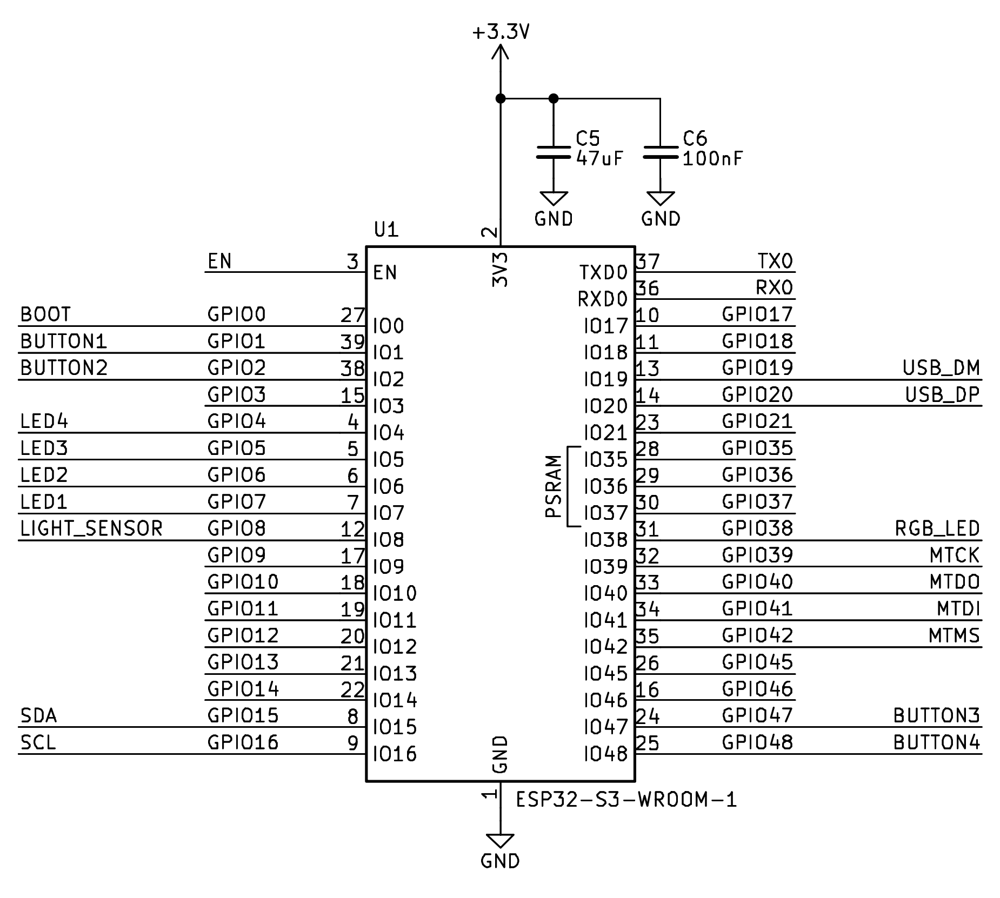

# FIIT ESP32 Kit
Board contains these components:
* 4x Buttons (needs internal pull-up resistor)
* 4x LED (red, yellow, green, blue)
* Programmable RGB LED
* Temperature & Humidity I2C Sensor AHT20
* Analog Light Sensor SFH320
* 2x QWIIC I2C connectors

For uploading code use USB UART by default.

## Pinout

GPIOX represents the pin marking, where X is the pin number that needs to be used in the Arduino IDE.

Please consider proper electrical connection to prevent electrical shortcuts.